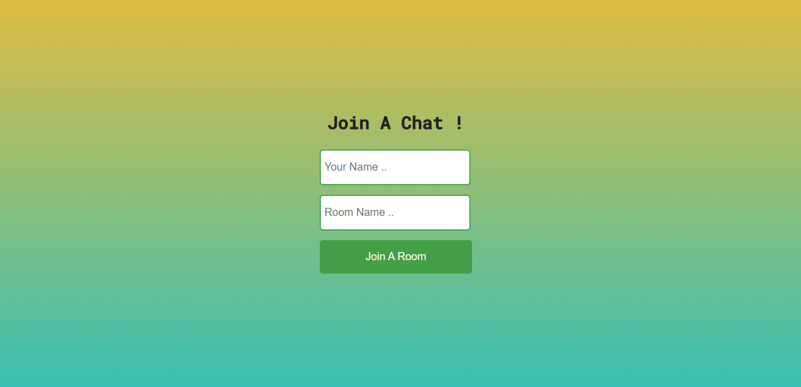

<br />
<div align="center">
  <h1 align="center">Live Chat App</h1>
  <q align="center">
  
   </q>
</div>

<details>
  <summary>Table of Contents</summary>
  <ol>
    <li>
      <a href="#about-the-project">About The Project</a>
      <ul>
        <li><a href="#Technologies">Technologies</a></li>
      </ul>
    </li>
    <li>
      <a href="#getting-started">Getting Started</a>
      <ul>
        <li><a href="#prerequisites">Prerequisites</a></li>
        <li><a href="#installation">Installation</a></li>
      </ul>
    </li>
    <li><a href="#Clint-Side">Usage</a></li>
    <li><a href="#contact">Contact</a></li>
  </ol>
</details>

<!-- ABOUT THE PROJECT -->

## About The Project



Live Chat App where you can send and recieve messages from different users at the same room
made by React , NodeJs , Socket.io

### Technologies

Here is what you need to run this app .

- [![Node.js][Node.com]](Node-url)
- [![React][React.js]][React-url]
- [![Socket.IO][Socket.io]][socket-url]

<!-- GETTING STARTED -->

## Getting Started

Follow next steps to know how to run the App ☺.

### Prerequisites

- [Node](https://nodejs.org/en)

### Installation

1. Clone the repo or you can download it

   ```sh
   git clone https://github.com/MohanedMohamedKhalil/Chat-App
   ```

2. move to server-side folder

   open cmd or visual-studio terminal

   ```js
   npm install
   npm start
   ```

3. move to client-side folder and open cmd or visual-studio terminal .

   ```js
    npm install
   npm start;
   ```

List of Packages for development .

```sh
// backend

express
http
cors
socket.io


// frontend

react
react-dom
react-scroll-to-bottom
socket.io-client
```

<!-- USAGE EXAMPLES -->

## Clint-Side

after all installations app will be run at http://localhost:3000

- Home Page
  

- Chat in User 1
  

- Chat in User 2
  

<!-- ROADMAP -->

<!-- CONTACT -->

## Contact

mohanedmohamed41@gmail.com - [LinkendIn](https://www.linkedin.com/in/mohaned-mohamed-khalil/)

<!-- Icons -->

[React.js]: https://img.shields.io/badge/React-20232A?style=for-the-badge&logo=react&logoColor=61DAFB
[React-url]: https://reactjs.org/
[Node.com]: https://img.shields.io/badge/Node.js-18.x-green?style=for-the-badge&logo=node.js&logoColor=white
[Node-url]: https://nodejs.org/
[Socket.io]: https://img.shields.io/badge/Socket.io-black?style=for-the-badge&logo=socket.io&badgeColor=010101
[socket-url]: https://socket.io/
